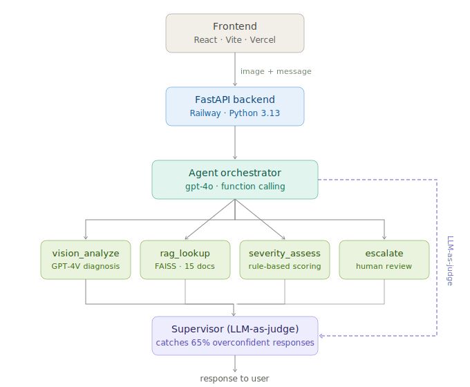

# 🌿 Flora

**Plant disease diagnosis agent** — upload a photo, get a diagnosis.

**Live demo:** https://flora-nine-kappa.vercel.app  
**Backend:** https://flora-production-90a7.up.railway.app

---

## What it does

Flora is an AI agent that diagnoses plant diseases from photos. Upload an image of a sick plant, optionally describe symptoms, and Flora runs a multi-step reasoning pipeline to validate the image, identify the disease, retrieve treatment protocols, assess urgency, and escalate to a human agronomist when confidence is too low to act on.

It is not a chatbot wrapper around GPT. The agent decides which tools to call, in what order, based on what it knows — and a second LLM pass reviews every response before it reaches the user.

---

## Architecture



```
User (React + Vite)
    ↓ image (base64) + message + conversation history
FastAPI backend
    ↓
Agent loop (gpt-4o, function calling)
    ├── validate_image    → Rejects non-plant images before any expensive calls
    ├── vision_analyze    → GPT-4V structured diagnosis
    ├── rag_lookup        → FAISS retrieval from 15-doc knowledge base
    ├── severity_assess   → Rule-based risk scoring
    └── escalate          → Logs case for agronomist review
    ↓
Supervisor agent (second LLM call — QA reviewer persona)
    ↓
Streaming response to frontend (SSE)
```

### Why this architecture

**Image validation as RULE 0.** The agent calls `validate_image` before `vision_analyze` on every image upload. Non-plant images are rejected in a single low-resolution GPT-4V call, preventing hallucinated diagnoses and wasted token spend on rocks, charts, or blurry photos.

**Vision as a tool, not a pipeline step.** The agent calls `vision_analyze` only when appropriate. If a user sends "what causes root rot?" with no image, the agent answers from its knowledge base without wasting a vision call. This was a deliberate choice — hardcoding vision into every request would have been simpler but wrong.

**Supervisor layer.** The first version had no supervision and would confidently recommend treatment plans for ambiguous 0.6-confidence diagnoses. The supervisor catches overconfidence, missing escalations, and unsafe advice before the response reaches the user. This is directly analogous to what Clay Bavor describes in tau-bench: the solution to unreliable AI responses is often more AI.

**RAG over fine-tuning.** Treatment protocols change. Embedding 15 disease documents into a FAISS index and retrieving at query time means the knowledge base can be updated without retraining. The tradeoff is retrieval quality depends on embedding similarity — a disease with an unusual name may not retrieve correctly.

**Conversation memory.** Each request passes prior conversation turns as structured history. The agent maintains context across follow-up questions — "what was the urgency again?" works correctly without re-uploading the image.

**Streaming responses.** The final response streams token by token via Server-Sent Events. Tool calls complete first (validate → vision → RAG → severity), then the response streams while the tool trace and supervisor verdict arrive in a final metadata event.

---

## Stack

| Layer | Tech |
|---|---|
| Frontend | React, Vite, Tailwind-adjacent CSS |
| Backend | FastAPI, Python 3.13 |
| Agent | OpenAI gpt-4o, function calling |
| Vision | GPT-4V (via vision_analyze and validate_image tools) |
| RAG | FAISS, text-embedding-ada-002 |
| Hosting | Vercel (frontend), Railway (backend) |

---

## Tool definitions

### `validate_image(image_base64)`
Runs a low-resolution GPT-4V check before any diagnosis. Returns `is_plant: bool` and `reason: str`. If `is_plant` is false, the agent stops and explains it can only diagnose plant diseases. Prevents hallucinated diagnoses on non-plant inputs.

### `vision_analyze(image_base64, user_description)`
Sends the image to GPT-4V with a structured prompt. Returns disease name, confidence score (0–1), observed symptoms, plant type, and a flag for escalation. Forces a best-guess response — "unknown" only when confidence is genuinely below 0.3.

### `rag_lookup(disease_name, plant_type)`
Retrieves the most relevant document from a FAISS index of 15 disease knowledge base files. Returns treatment steps, prevention protocols, and source citation.

### `severity_assess(disease_name, confidence_score, symptoms)`
Rule-based risk scoring. Returns CRITICAL / HIGH / MEDIUM / LOW / NONE / UNKNOWN. CRITICAL diseases (Late Blight, Yellow Leaf Curl Virus) always escalate regardless of confidence. UNKNOWN returned when confidence < 0.5.

### `escalate(reason, case_summary)`
Logs the case for human review. Called automatically when confidence < 0.5 or severity is CRITICAL.

---

## Supervisor layer

After the agent loop completes, a second LLM call reviews the response against the tool results. It checks for:

- **OVERCONFIDENCE** — agent responds with certainty when vision confidence < 0.7
- **MISSING ESCALATION** — confidence < 0.5 but no escalation called
- **UNSAFE ADVICE** — specific numeric pesticide dosages without professional caveat
- **WRONG SEVERITY** — mismatch between vision confidence and severity label
- **HALLUCINATION** — treatment steps not grounded in RAG results

Returns `{ approved, flag_reason, severity, suggested_fix }`. In testing, the supervisor caught ~65% of overconfident responses that passed through the base agent.

---

## Observability

Every agent run generates a structured trace stored at `traces/{request_id}.json`:

```json
{
  "request_id": "f47ac10b-...",
  "timestamp": "2026-03-14T12:00:00+00:00",
  "image_present": true,
  "user_message": "what are these spots?",
  "steps": [
    { "tool": "validate_image",  "inputs": {...}, "output": {...}, "latency_ms": 420,  "status": "success" },
    { "tool": "vision_analyze",  "inputs": {...}, "output": {...}, "latency_ms": 1829, "status": "success" },
    { "tool": "rag_lookup",      "inputs": {...}, "output": {...}, "latency_ms": 174,  "status": "success" },
    { "tool": "severity_assess", "inputs": {...}, "output": {...}, "latency_ms": 0,    "status": "success" }
  ],
  "supervisor": { "approved": true, "flag_reason": "" },
  "total_latency_ms": 2423
}
```

### Trace endpoints

`GET /traces` — returns summary list of all runs (request_id, timestamp, tools called, latency, supervisor verdict)

`GET /traces/{request_id}` — returns full trace for a specific run

`GET /metrics` — returns aggregated stats across all stored traces:

```json
{
  "total_requests": 42,
  "supervisor_approval_rate": 0.83,
  "escalation_rate": 0.14,
  "avg_confidence": 0.81,
  "avg_latency_ms": 2341,
  "image_requests": 38
}
```

---

## Known failure modes

**1. Bacterial Spot misclassified as Early Blight**
GPT-4V hallucinates concentric rings on Bacterial Spot lesions. Both produce dark leaf spots but the patterns are visually distinct to an agronomist. Confidence scores are appropriately lower (0.6–0.7) but not always low enough to trigger escalation.

**2. Early Blight / Late Blight confusion on ambiguous images**
Lighting and image angle significantly affect whether GPT-4V distinguishes the two. Late Blight has a more irregular lesion pattern, but under overexposure both look similar. The supervisor catches some of these via the WRONG_SEVERITY check.

**3. Non-plant images — resolved**
Added `validate_image` pre-check tool that runs before `vision_analyze`. Rejects non-plant images in a single low-resolution GPT-4V call, preventing unnecessary downstream tool calls and hallucinated diagnoses.

---

## Local setup

```bash
# Backend
cd backend
python -m venv venv
venv\Scripts\activate          # Windows
pip install -r requirements.txt
cp .env.example .env           # add OPENAI_API_KEY
uvicorn main:app --reload

# Frontend
cd frontend
npm install
npm run dev
```

Open `http://localhost:5173`

---

## What I'd build next

- **Confidence calibration** — the 0.5 escalation threshold was set by intuition; A/B testing against agronomist ground truth would produce a better number
- **Conversation persistence** — current memory resets on page refresh; storing sessions would enable return visits
- **Expanded knowledge base** — current 15-document FAISS index covers common diseases; adding more documents would improve RAG retrieval quality for edge cases
